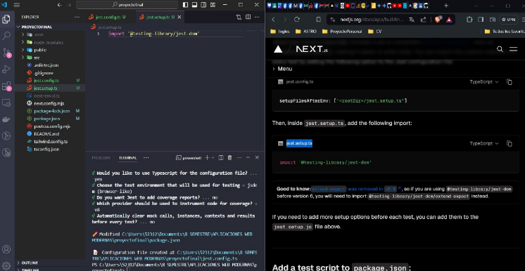

# Descripción del Proyecto

En este proyecto lo que hicimos fue reutilizar una actividad pasada donde usamos una base de datos como back-end para poder guardar datos de lo que trata nuestro proyecto los programas que utilizamos fueron los siguientes:

### Back-end

- Docker 
- Postman
- Dbeaver
- API en Visual Studio Code 

### Front-end

- API en Visual Studio Code
- Framework Next.js

Mi proyecto se basa en un recordatorio de citas medicas, pero para esta actividad lo que implementé fueron dos pantallas hechas con el framework de Next.js que simulen un formulario donde pueda agregar los datos en los campos de:

- Nombre de Medicamento
- Gramos
- Precio
- Marca

Y un Dashboard donde al presionar el boton para guardar los datos anterior puestos en formulario aparezcan ahí.
Por ultimo realiza una tercera pantalla algo un poco más interactiva para saber el precio del medicamento más caro y más barato del que están registrados.

# Instrucciones de Intalación y Ejecución

## Back-end

En Docker creé una imagen tal como la siguiente:


Donde se ve el estado de nuestra base y nos dice si todo esta correcto


Ya tenía una base de datos antigua que edité para este proyecto la tabla final fue la siguiente:

```sql 
CREATE TABLE Medicina(

    id_numMedicina   INTEGER         NOT NULL     AUTO_INCREMENT,
    nombre          VARCHAR(150)     NOT NULL,
    gramos          INTEGER(150)     NOT NULL,
    precio          INTEGER(150)     NOT NULL,
    marca           VARCHAR(150)     NOT NULL,
    PRIMARY KEY(id_numMedicina)

);
```
Para resumidas cuentas en la API lo que hice fue llamar a los componentes Controllers y Model de "Medicina" de la siguiente manera:


Despues de hacer los cambios en la base de datos y guardalos en la terminal tengo que bajar y subir el docker de la siguiente manera:

Bajarlo:
```
docker-compose down -v
```
Subirlo:
```
docker-compose up --build -d  
```


Luego nos vamos a Postman y vemos si funciona el Post y Get:

### Get


### Post


Cuando todo está listo y funcionando copiamos el código que nos da Postman con el Fecth para poderlo copiarlo en el API del front-end.

### Fetch


## Front-end

Creé el archivo con el siguiente comando:

```
npm create vite@latest proyectoFinal --template react-ts
```
y lo corrí con la linea de código:
```
npm run dev
```
se abre de la siguiente manera:


Creé la API de front-end en Visual Studio Code con el framework de Next.js

Tengo tres componentes principales:

- Dashboard
- Precios
- Formulario

### Dashboard 

``` typescript
useEffect(() => {
    fetch("http://localhost:3100/Medicina")
      .then((response) => response.json())
      .then((data) => {
        setMedicines(data);

        if (data.length > 0) {

          const mostExpensiveMedicine = data.reduce((prev: Medicine, current: Medicine) => {
            return parseFloat(current.precio) > parseFloat(prev.precio) ? current : prev;
          });
          localStorage.setItem("mostExpensiveMedicine", JSON.stringify(mostExpensiveMedicine));


          const cheapestMedicine = data.reduce((prev: Medicine, current: Medicine) => {
            return parseFloat(current.precio) < parseFloat(prev.precio) ? current : prev;
          });
          localStorage.setItem("cheapestMedicine", JSON.stringify(cheapestMedicine));
        }
      })
      .catch((error) => console.error(error));
  }, []);
```

### Precios

``` typescript
const Precios: React.FC = () => {
  const [medicines, setMedicines] = useState<Medicine[]>([]);
  const [mostExpensiveMedicine, setMostExpensiveMedicine] = useState<Medicine | null>(null);
  const [cheapestMedicine, setCheapestMedicine] = useState<Medicine | null>(null);
  const router = useRouter();

  useEffect(() => {
    fetch("http://localhost:3100/Medicina")
      .then((response) => response.json())
      .then((data) => {
        setMedicines(data);
      })
      .catch((error) => console.error(error));
  }, []);
```
### Formulario

``` typescript
fetch("http://localhost:3100/Medicina", requestOptions)
      .then((response) => response.text())
      .then((result) => console.log(result))
      .catch((error) => console.error(error));
    console.log("datos del tema: ", Medicina);

    router.push("/");
  };
```
## Mockups 

Aquí solo se muestran los registros que se llevan a cabo en la pantalla de Formulario, además de dos botones que nos llevan a las otras dos pantallas.


El formulario tiene validaciones para que todos los campos tengan que estar llenos para poder guardalos, también para que no se puedan poner letras en donde van números ni numeros negativos y donde van nombres o letras no acepte números. En esta pantalla solo tienes que agregar información en los campos y dar a guardar para mandar a Dashboard los datos. Tambien puedes ver los precios. 


En esta pantalla solo tienes que presionar el boton para poder saber cual es el precio del medicamento más caro y más barato.


## Pruebas con React Testing Library

React Testing Library es una biblioteca que ayuda a realizar pruebas de componentes React. Se enfoca en cómo interactúa un usuario con la interfaz, en lugar de centrarse en la implementación interna de los componentes. Esto fomenta las pruebas más realistas y centradas en el usuario.





